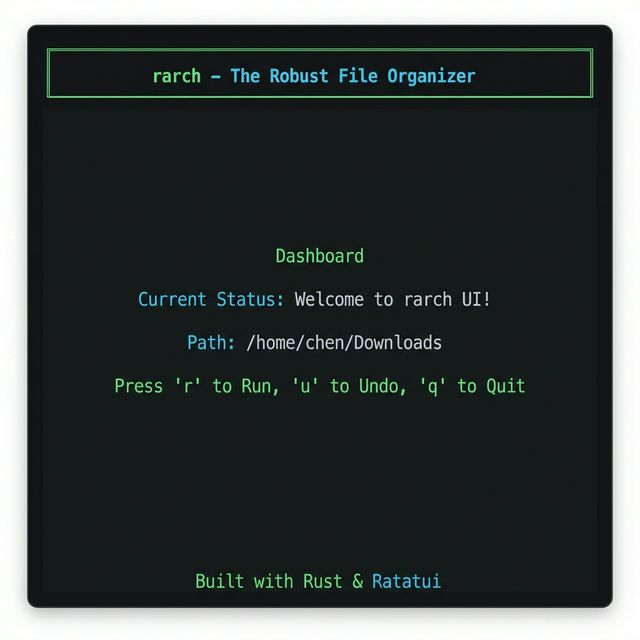
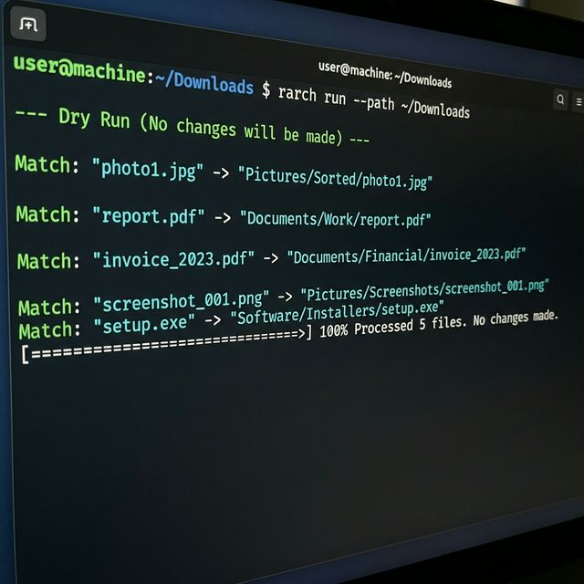

# 归藏 (rarch)

[English](README.md) | [简体中文](README_ZH.md)

> **The Robust File Organizer** — 基于 Rust 构建的高性能、内容感知且具备原子化撤销能力的文件治理专家。

[]()
[]()
[]()

## 为什么选择归藏？

市面上大多数文件整理工具仅简单依赖文件后缀名。**归藏 (rarch)** 专为追求数据完整性、存储效率和极致操作体验的高级用户设计。

### 视觉演示

<p align="center">
  
  <br>
  <em>rarch 交互式 TUI 仪表盘</em>
</p>

<p align="center">
  
  <br>
  <em>rarch CLI 运行预览（Dry-Run）</em>
</p>

### 核心特性

- **极速引擎**: 由 Rust 和 `rayon` 驱动的并行处理逻辑。秒级完成 10 万级文件的扫描与归档。
- **原子化撤销 (Undo)**: 每一笔移动都有交易级日志记录。如果发现规则写错，`rarch undo` 能将所有文件精准还原至原位。
- **内容感知**: 拒绝后缀名欺骗。归藏利用深度二进制头（Magic Number）识别，即使 `.png` 被重命名为 `.txt` 也能准确归位。
- **硬链接去重**: 自动检测内容一致的文件并创建硬链接，在不移动文件的情况下拯救空间。
- **正则与时间过滤**: 支持正则表达式匹配文件名，以及基于文件年龄（如“30天前”）的归档逻辑。
- **变量路径支持**: 目标路径支持 `${year}`, `${month}`, `${ext}` 等动态占位符。
- **专业预览报表**: Dry-run 模式提供精美的表格总结及“预估节省空间”报告。
- **多壳补全**: 自动生成 Bash, Zsh, Fish 和 PowerShell 的命令行补全脚本。
- **实时守望模式**: 运行 `rarch watch` 监控目录，文件到达即刻处理。
- **交互式仪表盘 (TUI)**: 为键盘发烧友设计的终端美学界面。
- **AI 智能引擎**: 支持原生离线 AI（无需配置，开箱即用）或连接本地大模型（如 Ollama），实现基于文件内容的智能分类、重命名和信息提取。

## 安装

```bash
# 基础安装（包含 TUI）
cargo install rarch --features ui

# 启用原生离线 AI 支持（开箱即用，自动下载模型）
cargo install rarch --features "ui ai-native"

# 启用 API AI 支持（需配合 Ollama 等本地服务）
cargo install rarch --features "ui ai"
```

## 使用指南

### 1. 配置规则

创建 `rarch.toml`:

```toml
[[rules]]
name = "照片"
mime = "image/*"
target = "Pictures/${year}"
conflict = "rename"

[[rules]]
name = "智能发票提取"
ai_extract = { company = "提取发票中的公司名称" }
target = "Finance/${ai_company}/${year}"
extensions = ["txt", "pdf"]
```

### 2. 批量整理

```bash
# 首先进行干跑预览（不实际移动文件）
rarch run --dry-run

# 执行正式整理与去重
rarch run --path ~/Downloads
```

### 3. 撤销操作

如果您对结果不满意：

```bash
rarch undo
```

### 4. 实时监控

开启后即可静默后台自动整理：

```bash
rarch watch --path ~/Downloads
```

## 架构设计

1. **扫描层 (Scanner)**: 支持深度或浅层目录遍历。
2. **核心引擎 (Engine)**:
    - 并行哈希计算 (SHA-256)。
    - 文件内容特征推断。
    - 基于链接的去重分支逻辑。
3. **日志层 (Journal)**: 基于 JSON 的事务日志，确保 Undo 操作 100% 可靠。
4. **交互层 (UI)**: 基于 `ratatui` 构建的零依赖终端用户界面。

## 许可证

MIT OR Apache-2.0
